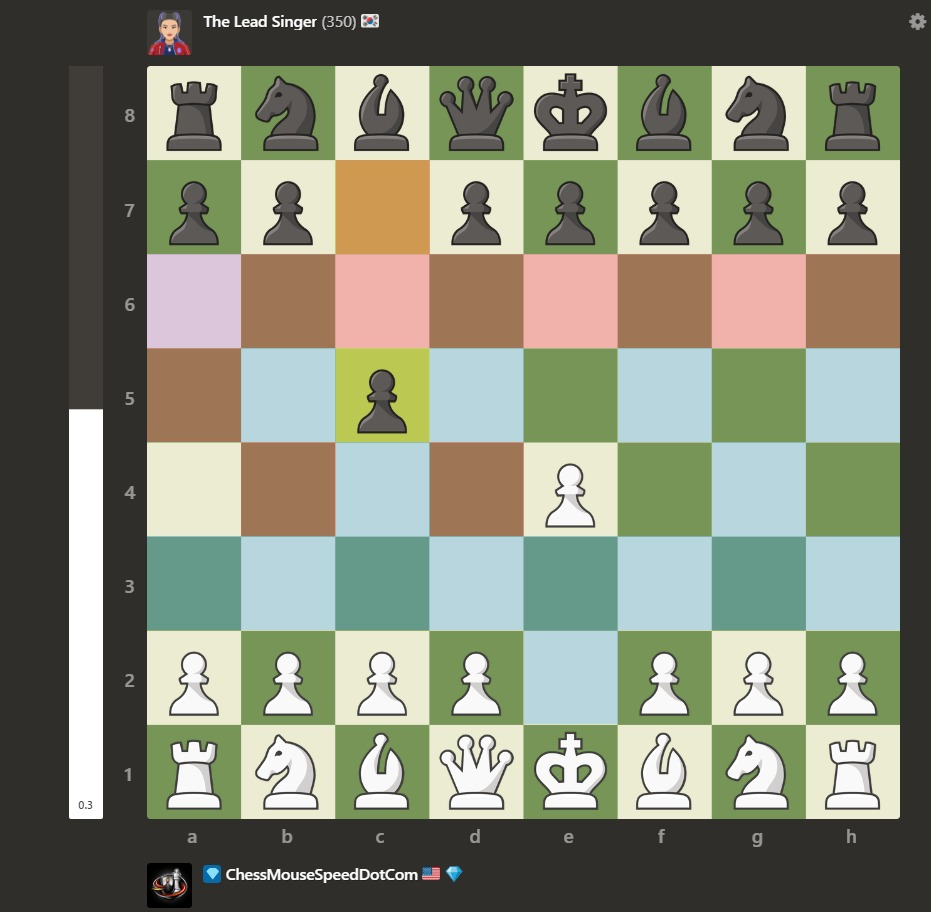

# Chess Square Control Overlay
# Author: YohApps.com

A Chrome extension that visualizes square control on [chess.com](https://www.chess.com). See at a glance which squares are attacked by White, Black, or both — great for training board vision.



## What It Shows

| Color | Meaning |
|-------|---------|
| 🔵 Blue | White controls this square |
| 🔴 Red | Black controls this square |
| 🟣 Purple | Contested — both sides attack it |
| No overlay | Uncontrolled (or has a piece on it) |

Squares with pieces on them are left clear so the board stays readable.

## How It Works

The extension reads piece positions directly from chess.com's DOM, then computes all attacked squares for each color — including sliding piece rays (bishops, rooks, queens) with proper blocking. The overlay updates automatically every time the position changes.

## Install (Developer Mode)

1. Download or clone this repo
2. Open `chrome://extensions` in Chrome
3. Enable **Developer mode** (top-right toggle)
4. Click **Load unpacked**
5. Select the extension folder

No packing or key file required for local use.

## Usage

- Navigate to any chess.com page with a board (games, analysis, puzzles, bots)
- The overlay appears automatically
- Click the **🔲 Control: ON** button (bottom-right) to toggle it off/on

## Intended Use

This tool is designed for **training and analysis**:
- Reviewing completed games
- Playing against bots
- Studying positions on the analysis board
- Training your eyes to see square control

**Please do not use this during rated games against real opponents** — that would violate chess.com's fair play policy.

## Files

```
manifest.json   — Chrome extension config (Manifest V3)
content.js      — Board reading, attack computation, overlay rendering
styles.css      — Overlay colors and toggle button styling
```

## License

MIT


